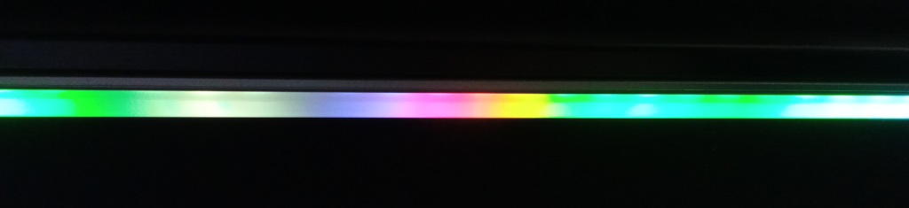

# What

(2024-09/2024-10)

Lua interface for sending data to RGB stripe.



## Lua example and design

Excerpt from [MakeTest.lua][MakeTest].

```Lua
Output:OpenFile(OutputFileName)

Stripe:Init(Output)

Stripe:Reset()

local Blue = { Red = 0, Green = 0, Blue = 255 }
local Green = { Red = 0, Green = 255, Blue = 0 }
local Red = { Red = 255, Green = 0, Blue = 0 }

Stripe:SetPixel({ Index = 12, Color = Blue })
Stripe:SetPixel({ Index = 30, Color = Green })
Stripe:SetPixel({ Index = 48, Color = Red })

Stripe:Display()

Output:CloseFile()
```

Generates this data

```
( R )
( SP 012  000 000 255 )
( SP 030  000 255 000 )
( SP 048  255 000 000 )
( D )
( DelayMs 1 )
```

[MakePlasm][MakePlasm] generates data for whole stripe which looks like

```
( R )
(
  SPR 000 059
    068 014 031  050 040 038  068 036 032  068 011 046
    050 000 018  068 018 035  068 000 029  068 000 055
    028 033 009  020 017 000  000 029 025  000 046 000
    002 027 001  026 000 000  027 000 000  009 009 000
    010 000 000  000 000 011  019 018 000  020 031 000
    000 025 003  000 054 038  019 062 043  000 068 014
    000 068 009  000 068 000  011 068 021  000 064 000
    003 045 023  011 000 017  013 000 017  008 000 000
    019 000 000  014 002 006  004 026 013  012 002 061
    060 010 068  050 000 068  066 009 052  064 022 043
    036 000 048  015 000 027  027 000 005  024 009 006
    004 046 000  019 035 000  006 058 025  000 058 034
    024 056 037  026 027 000  029 012 000  023 000 000
    008 000 020  000 000 006  004 015 000  000 000 012
    047 044 016  056 057 045  058 065 039  061 057 008
)
( D )
( DelayMs 1 )
```

[SendData.lua][SendData] parses that data and sends commands to stripe.

[RunDemo.sh][RunDemo] is just a delayed loop of MakePlasm and SendData.


## Components

RGB stripe is connected to Arduino. Arduino is connected to USB.
USB can be accessed as "file" `/dev/ttyUSB0` or something like that.

On Arduino is [firmware][Firmware] (written by me in C++).
It has text interface.

So you can always connect to device via serial interface (try
Serial Monitor from Arduino IDE or Arduino CLI). `115200 baud`.
Password.. no password, just connect and type `?`.


## Files

* [MakeTest.lua](MakeTest.lua) is a basic test.

  It creates data file.

* [MakePlasm.lua](MakePlasm.lua) is a "Plasm" gradient generator.

  I've figured out this algorithm like twenty years ago and implemented
  2D versions in Delphi and QBASIC.

  It creates data file.

  Data file is recompiled to reduce transfer time. It's cool but
  not necessary step.

* [SendData.lua](SendData.lua) is a file sender.

  File is using my [Itness][Itness] format. Actually any text with
  balanced `()` and `[]` is in Itness format. It's used to separate
  data from representation.


### 1D Plasm

Here is basic idea for 1D version.

We want to generate color for every pixel in stripe.

We're setting border pixels to some random colors.

Then we can just set middle pixel to average color and divide.

But it's boring. We should add some noise.

So we're adding noise. Noise is actually smooth random color function
between first and last pixels. Value range [-1.0, +1.0].

Noise amplitude is dependent of distance between pixels. (Like gravity
is inversely proportional to distance square. Same idea.)

So for first iteration for two border pixels noise amplitude will have
greatest potential. To make it random, we multiply amplitude by
random value in [-1.0, +1.0]:

```
Noise = NoiseAmpl(Distance) * random(-1.0, +1.0)
```

Then we will amplify that noise to max color value and add it to
averaged color of middle pixel and divide. A lot more interesting!

```
ColorComponentNoise = floor(Noise * 0xFF)
```

To have more or less color transitions in our stripe, we're multiplying
distance by scale factor, keeping it in [0.0, 1.0] range:

```
Distance = Clamp(Scale * Distance, 0.0, 1.0)
```

And basically that's it.


#### Noise function

Generated gradient type is determined by noise amplitude function:

```
NoiseAmpl(Distance: [0.0, 1.0]): [-1.0, +1.0]
```

This function sets degree of freedom for given distance. Moreover,
it determines how degree of freedom changes when distance is decreasing.

I've tried several variants. Sine, quarter of circle, power.
You can find them in [MakePlasm.lua](MakePlasm.lua).

Tinkering with this function is fun!


## Requirements

For Lua side it's just Linux, stock Lua 5.3+ and this repo.

For Arduino side you'll need Arduino (lol), WS2812B RGB stripe,
`arduino-cli` framework and my implementation.


## See also

* [Server part][Firmware]
* [My other repositories][contents]

[Firmware]: https://github.com/martin-eden/Embedded-me_RgbStripeConsole
[Itness]: https://github.com/martin-eden/Lua-Itness
[contents]: https://github.com/martin-eden/contents

[MakeTest]: MakeTest.lua
[MakePlasm]: MakePlasm.lua
[SendData]: SendData.lua
[RunDemo]: RunDemo.sh
